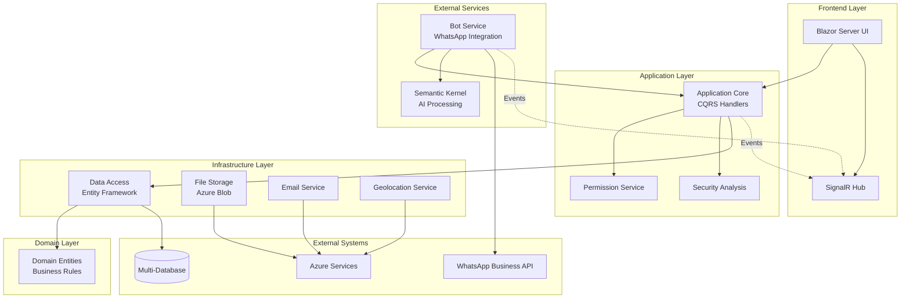

# Components

## Blazor Server UI Layer

**Responsibility:** Server-side rendered user interface with real-time updates and user interaction handling

**Key Interfaces:**
- `/Pages` - Razor page components for routing and layout
- `/Components` - Reusable UI components with MudBlazor integration  
- `IHubContext<NotificationHub>` - SignalR real-time notifications
- `IMediator` - CQRS command/query dispatch to Application layer

**Dependencies:** Application layer (via MediatR), SignalR service, ASP.NET Core Identity

**Technology Stack:** Blazor Server (.NET 9), MudBlazor components, SignalR, Razor syntax with C#

## Application Core Layer

**Responsibility:** Business logic orchestration, CQRS handlers, and cross-cutting concerns implementation

**Key Interfaces:**
- `IRequestHandler<TRequest, TResponse>` - MediatR command/query handlers
- `IApplicationDbContext` - Database abstraction interface
- `IPermissionService` - Role-based authorization
- `ISecurityAnalysisService` - Risk assessment and threat detection

**Dependencies:** Domain entities, Infrastructure services (via interfaces), MediatR pipeline

**Technology Stack:** .NET 9, MediatR, FluentValidation, AutoMapper, FusionCache

## Bot Service Component

**Responsibility:** WhatsApp integration, AI conversation processing, and automated issue creation

**Key Interfaces:**
- `IBotFrameworkHttpAdapter` - Bot Framework message processing
- `ISemanticKernel` - AI conversation understanding and response generation
- `IMediator` - Issue creation commands to Application layer
- `/api/messages` - Bot Framework webhook endpoint

**Dependencies:** Application layer (shared database context), Azure Bot Service, Semantic Kernel plugins

**Technology Stack:** Microsoft Bot Framework 4.21+, Semantic Kernel 1.0+, Azure Communication Services

## Component Diagrams

