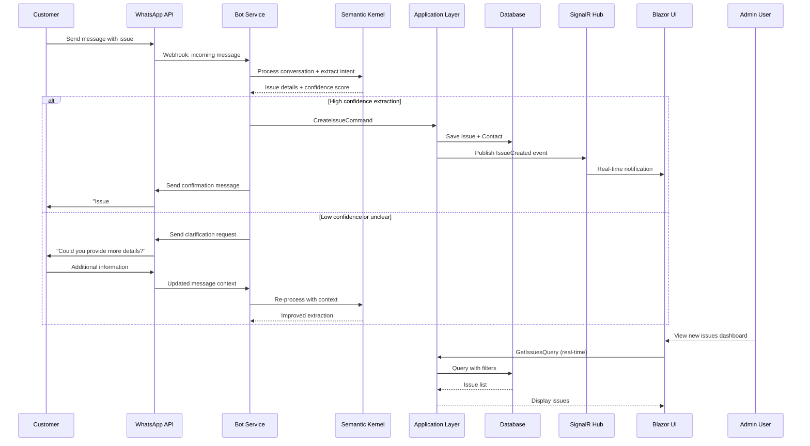
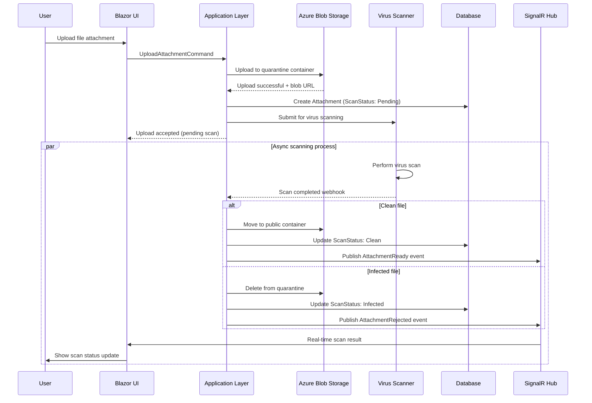

# Core Workflows

## WhatsApp Issue Intake Workflow

```mermaid
sequenceDiagram
    participant C as Customer
    participant WA as WhatsApp API
    participant Bot as Bot Service
    participant AI as Semantic Kernel
    participant App as Application Layer
    participant DB as Database
    participant SignalR as SignalR Hub
    participant UI as Blazor UI
    participant Admin as Admin User

    C->>WA: Send message with issue
    WA->>Bot: Webhook: incoming message
    Bot->>AI: Process conversation + extract intent
    AI-->>Bot: Issue details + confidence score
    
    alt High confidence extraction
        Bot->>App: CreateIssueCommand
        App->>DB: Save Issue + Contact
        App->>SignalR: Publish IssueCreated event
        SignalR->>UI: Real-time notification
        Bot->>WA: Send confirmation message
        WA->>C: "Issue #12345 created"
    else Low confidence or unclear
        Bot->>WA: Send clarification request
        WA->>C: "Could you provide more details?"
        C->>WA: Additional information
        WA->>Bot: Updated message context
        Bot->>AI: Re-process with context
        AI-->>Bot: Improved extraction
    end
    
    Admin->>UI: View new issues dashboard
    UI->>App: GetIssuesQuery (real-time)
    App->>DB: Query with filters
    DB-->>App: Issue list
    App-->>UI: Display issues
```

## File Attachment Upload with Security Scanning

```mermaid
sequenceDiagram
    participant User as User
    participant UI as Blazor UI
    participant App as Application Layer
    participant Storage as Azure Blob Storage
    participant Scan as Virus Scanner
    participant DB as Database
    participant SignalR as SignalR Hub

    User->>UI: Upload file attachment
    UI->>App: UploadAttachmentCommand
    
    App->>Storage: Upload to quarantine container
    Storage-->>App: Upload successful + blob URL
    
    App->>DB: Create Attachment (ScanStatus: Pending)
    App->>Scan: Submit for virus scanning
    App-->>UI: Upload accepted (pending scan)
    
    par Async scanning process
        Scan->>Scan: Perform virus scan
        Scan-->>App: Scan completed webhook
        
        alt Clean file
            App->>Storage: Move to public container
            App->>DB: Update ScanStatus: Clean
            App->>SignalR: Publish AttachmentReady event
        else Infected file
            App->>Storage: Delete from quarantine
            App->>DB: Update ScanStatus: Infected
            App->>SignalR: Publish AttachmentRejected event
        end
        
        SignalR->>UI: Real-time scan result
        UI->>User: Show scan status update
    end
```
