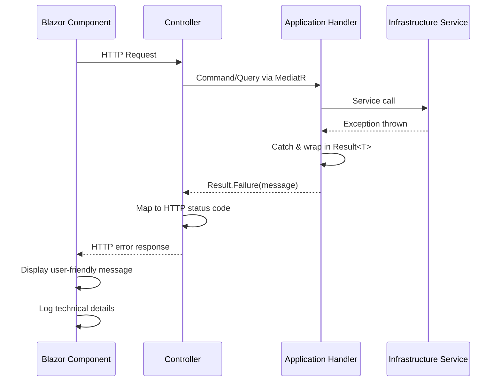

# Error Handling Strategy

## Error Flow


## Error Response Format
```typescript
interface ApiError {
  error: {
    code: string;           // ERROR_ISSUE_NOT_FOUND
    message: string;        // User-friendly message
    details?: Record<string, any>; // Validation errors
    timestamp: string;      // ISO 8601 timestamp
    requestId: string;      // Correlation ID for logs
  };
}
```
