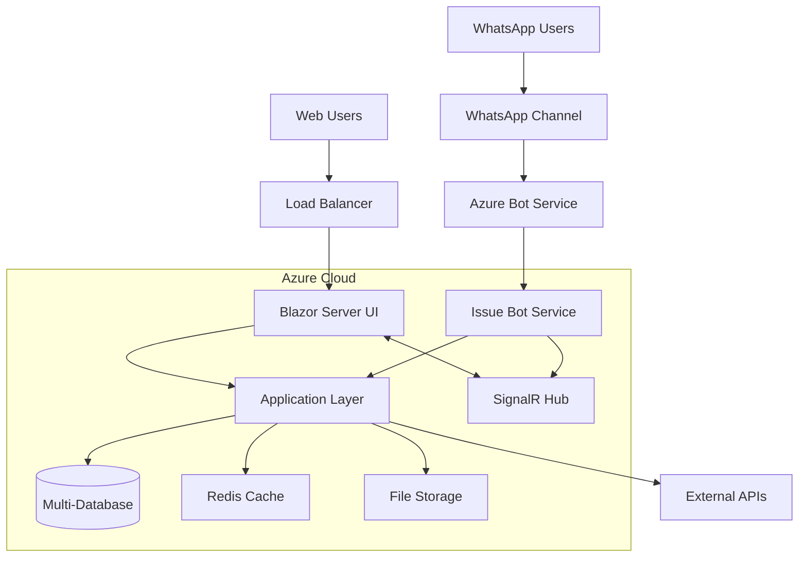

# High Level Architecture

## Technical Summary

The Issue Management System employs a **Clean Architecture pattern with Blazor Server frontend**, deployed on Azure/Windows hosting with multi-database support. The backend leverages .NET 9 with CQRS/MediatR patterns, Entity Framework for data access, and SignalR for real-time updates. A separate **Bot Framework service** handles WhatsApp integration using Semantic Kernel for AI-powered conversation processing. Key integration occurs through shared database context and event-driven communication, enabling seamless issue intake from WhatsApp conversations while maintaining architectural boundaries. The system supports enterprise-grade multi-tenancy with role-based permissions and comprehensive security analysis capabilities.

## Platform and Infrastructure Choice

**Selected Platform:** Microsoft Azure  
**Key Services:** App Service (Web Apps), Azure SQL Database, Bot Service, Application Insights, Azure Key Vault, SignalR Service  
**Deployment Host and Regions:** Azure App Service in primary region (configurable), with database geo-replication for disaster recovery

**Rationale:** Given the Microsoft technology stack (.NET 9, Bot Framework, Semantic Kernel) and enterprise features (multi-tenancy, security compliance), Azure provides the most seamless integration and lowest operational complexity.

## Repository Structure

**Structure:** Monorepo with solution-based organization  
**Monorepo Tool:** .NET Solution (.sln) with MSBuild project references  
**Package Organization:** Clean Architecture layering with separate projects for Bot service and database migrators

## High Level Architecture Diagram

## Architectural Patterns

- **Clean Architecture:** Domain-centric design with dependency inversion - _Rationale:_ Testability, maintainability, and technology independence
- **CQRS with MediatR:** Command Query Responsibility Segregation - _Rationale:_ Clear separation of read/write operations, better performance optimization
- **Repository Pattern:** Data access abstraction with Entity Framework - _Rationale:_ Database provider flexibility and testable data layer
- **Multi-tenant SaaS Pattern:** Tenant isolation with shared database - _Rationale:_ Cost efficiency while maintaining data security
- **Event-Driven Communication:** Domain events for cross-service integration - _Rationale:_ Loose coupling between UI and Bot services
- **API Gateway Pattern:** Centralized request handling through Application layer - _Rationale:_ Consistent authentication, validation, and logging
